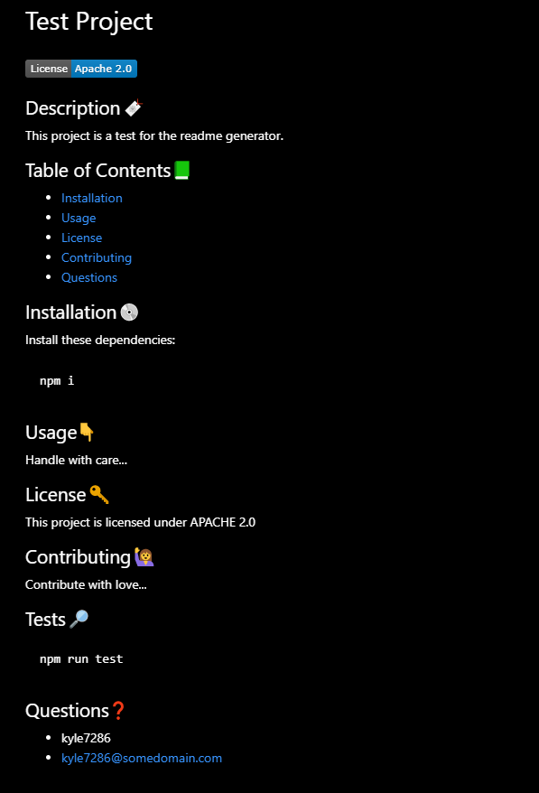

# Readme Generator

## General 📖
---    
- Author:         Brandon Haley
- Email:          Kyle7286@gmail.com
- Github:         https://github.com/Kyle7286/

## About/Purpose ❔
---
The purpose of this application is to generate a readme automatically with the input from the user to gain efficiencies and consistency.

## How to Use
---
1. node index
2. provide your input for all prompts
3. locate the readme located in the "generated" folder

## Takeaways 🥡
--- 
* Gained more confidence using node js
* Learned the usefulness of async function 
* Learned about license badges
* Realized the power of temporal literals

## Screenshot/Gif 📊
---

## Thank you 👍 
---
Thank you for your time reviewing my project/code!

